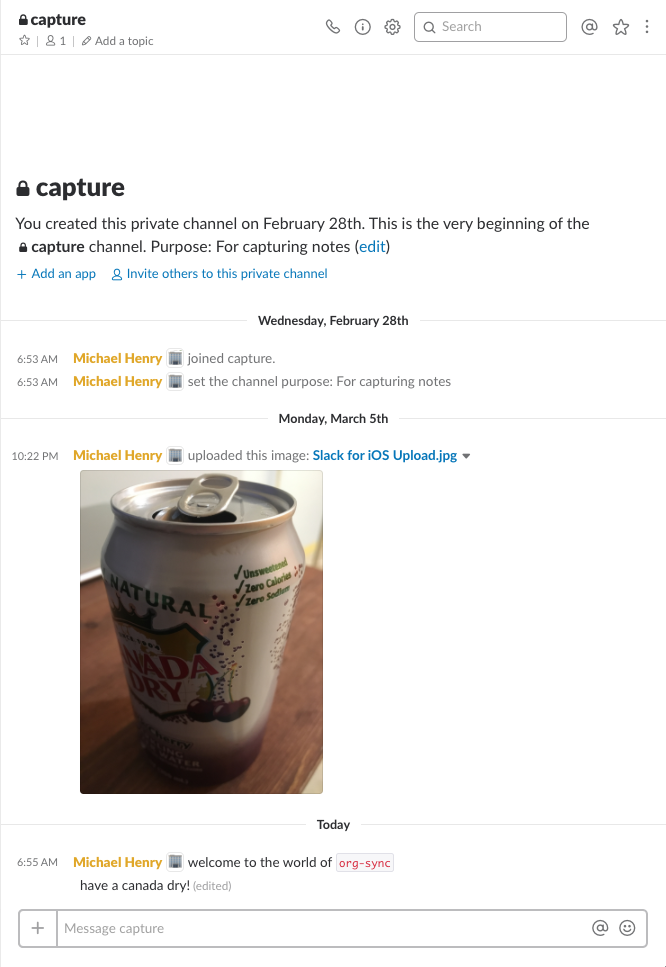
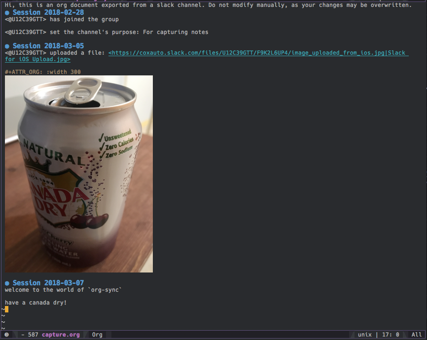

# org-sync

A Clojure program designed to monitor the history of a Slack conversation and synchronize that information to local files. It synchronizes one-way, and it includes both text and files posted to the conversation. The text is output as [org](https://orgmode.org/) format, and includes links to locally-cached versions of the referenced conversation files.

I find it convenient to capture pictures of whiteboards and ad-hoc notes from meetings on my phone. However, I manage my work in org files through emacs. This program attempts to fill the gap between the two, by allowing me to capture all sorts of notes in a private Slack channel, and then have them automatically synced to my org system on my computer.


## Usage

`org-sync` is a CLI application that you can run as a daemon in the background, or just run periodically through cron.

First, [install lein](https://leiningen.org/#install). Then run `lein uberjar` to build the project.

Then, take a look at the CLI options:

```
$ java -jar target/org-sync-0.1.0-SNAPSHOT-standalone.jar -h

org-sync - transcribes the contents of a slack channel into local files, encoded
           in org-mode format.

  -a, --api-url URL           https://slack.com/api/  Slack API URL
  -t, --api-token TOKEN                               Slack API Token
  -u, --username USERNAME                             Username whose IMs to sync from
  -c, --channel CHANNEL_NAME                          The Channel to sync from
  -g, --group GROUP_NAME                              The Group to sync from
  -o, --output-dir USERNAME                           Directory to sync into
  -m, --monitor                                       Continuously poll for changes to sync
  -i, --interval INTERVAL     5000                    Polling interval in milliseconds
  -h, --help
```

Here is an example of running the program:

```
$ JAR='target/org-sync-*-standalone.jar'
$ API_TOKEN='XXX'
$ java -jar $JAR --api-token $API_TOKEN --group 'capture' --output-dir ~/notes/slack-capture --monitor --interval 5000
changes detected since  nil : latest is 1520423747.000227
get-cached-file: fetching https://files.slack.com/files-pri/T02LRKTL7-F9K2L6UP4/image_uploaded_from_ios.jpg -> file:/Users/ddcmhenry/notes/slack-capture/cache/F9K2L6UP4.jpg
waiting
```

This example tells `org-sync` to run continuously, checking the private slack room `#capture` for updates every 5 seconds and replicates the entire history for that room into the local folder `~/notes/slack-capture`. You can leave off the `--monitor` flag and it will just do a single sync of that channel and then exit.

Here is a screenshot of the `#capture` group in Slack:



Here is the same `#capture` channel in emacs `org-mode` a few seconds later:



*Success!*

## Slack App Configuration

In order to use this program, you will need to configure a Slack Application for your Slack Team, grant it the required scopes for Slack API access, and obtain an access token for it to use. 

This is relatively straightforward: first, go here to get started: https://api.slack.com/apps

Here are some points of advice for getting this to work:
* configure a bot name in the "Bot Users" section
* use the "OAuth Access Token", not the "Bot User OAuth Access Token".
* under "OAuth and Permissions" configure the following scopes:
    ```
    bot
    channels:history
    channels:read
    files:read
    groups:history
    groups:read
    im:history
    im:read
    ```
    
## Known Issues
### Rate Limiting
This program doesn't deal gracefully if the slack history is large and many pages of messages must be fetched. The Slack API rate limits permit bursting, but after a short while will throttle the program to roughly 1 request per second. In the future I'd like to make it tolerate this with backoffs and retries, but it hasn't really presented a problem for me yet.

## Feature Ideas
- tolerate API throttling with backoffs and retries
- install via brew
- support org links in text
- support org code blocks
- make the logging output better formatted, with more helpful information about what it is doing
- send a desktop notification when new changes are picked up?
- put a log file somewhere for debugging when deployed
- do proper oauth, don't just depend on developer keys
- fully automate the setup of the client in such that setting it up in a team is trivial
- clean up missing specs and tests for side-effecting things

## Disclaimer

This is a thing I wrote for my own purposes. I put it on github in case someone else might find it useful, as well as to hold myself to a discipline of finishing things. Please don't hook up your pacemaker to this thing.

## License

Copyright © 2018 Michael Henry

Distributed under the MIT License.

